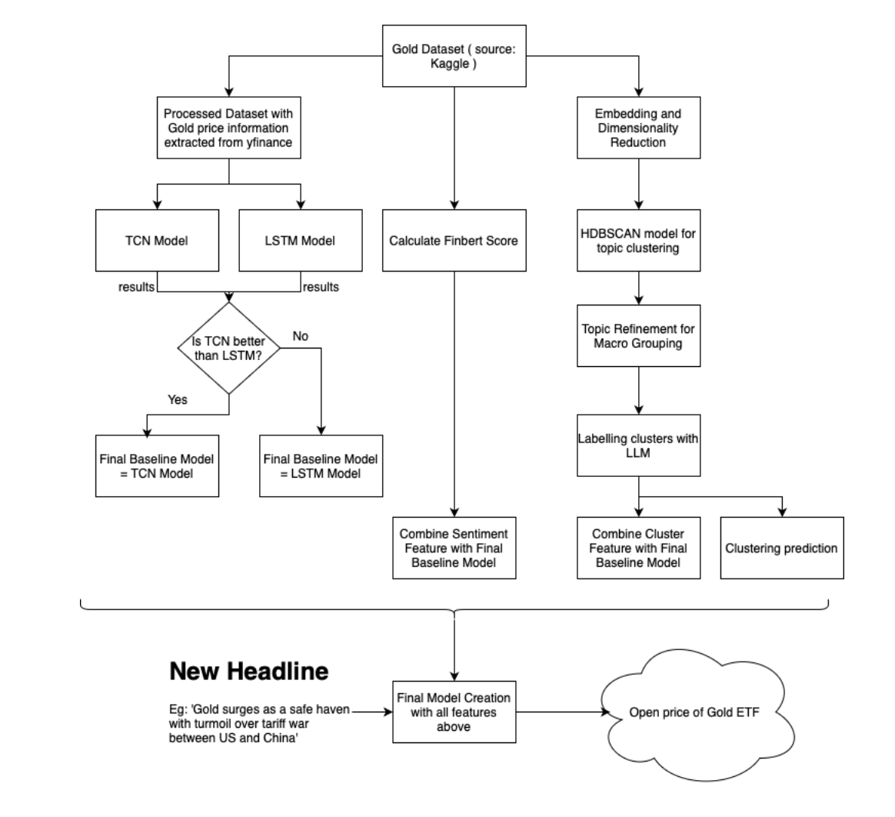

# IDS_705_Final_Project : Gold Price Prediction using News Sentiment and Thematic Clustering

## by: Arko Bhattacharya, Zachary Fennie, Vishesh Gupta, Danish Maknojia, Chris Moreira

## Introduction

Gold, the world's oldest financial asset, remains critical with wide-reaching implications across finance, investment, and policy making. As a global benchmark for economic stability and a safe haven during market volatility, gold maintains unique value due to its immunity to inflation and monetary policy fluctuations. 

Forecasting gold price is further complicated by the Efficient Market Hypothesis (EMH), which posits that asset prices fully reflect all available information. Our research attempts to enhance directional accuracy by incorporating sentiment-related features—potentially revealing inefficiencies in the market exploitable through trading strategies. Machine learning (ML) and natural language processing (NLP) enable sophisticated insights, yet prediction remains challenging due to gold’s sensitivity to geopolitical and economic events.

We propose a comprehensive framework that integrates NLP techniques and traditional market analysis. Our fourfold approach is:

1. Construct a baseline model using historical price data.
2. Enhance the model with sentiment scores from gold-related headlines.
3. Analyze overarching narrative themes via clustering.
4. Combine all insights into a single model for robust prediction.

We evaluate performance improvements at each step and discuss implications for financial forecasting.

## Data

### Sources

- **News Data**: Annotated gold-related financial news dataset from Sinha and Khandait (2020, 2021) via Kaggle.
- **Market Data**: Historical gold prices retrieved from Yahoo Finance using `yfinance`.

## Experiment Flow

Our process traces the evolution from traditional time-series forecasting to a hybrid approach incorporating unstructured news data.

### Step-by-Step Pipeline

1. **Baseline Model**: LSTM using historical gold prices to predict next-day percent change.
2. **Sentiment Enhancement**: Scores from over 10,000 headlines are extracted using NLP and added to the model.
3. **Thematic Discovery**: BERTopic clustering identifies macro themes in news, providing contextual richness.
4. **Unified Model**: Combines all features (price, sentiment, themes) for final prediction.

The resulting unified model leverages both quantitative signals and qualitative narratives for improved performance.

## Results

Our performance evaluation reveals the added value of sentiment and clustering features:

| Model | Directional Accuracy |
|-------|-----------------------|
| Baseline LSTM | < 50% |
| + Sentiment Scores | 50.86% |
| + Thematic Clusters | 50.52% |
| Combined Model | 52.58% |
| Combined + Retraining | 57.93% |

Our combined model outperforms traditional approaches and holds potential for real-time application. The ability to successfully predict a next-day price increase using real-time news headlines indicates robustness.

The thematic clustering approach—identifying 18 macro-level themes—emerges as a strong foundation for extending to other assets or incorporating additional data (e.g., social media, macroeconomic indicators).

## Conclusion

This project highlights how sentiment and narrative features from financial news can enhance gold price forecasting when integrated into traditional models. While LSTM models with historical data alone underperform under volatility, adding sentiment scores and clustered themes significantly improves predictive power.

Notable takeaways:

- NLP techniques offer contextual depth missing from traditional indicators.
- Clustering of semantically similar news headlines captures macroeconomic and investor sentiment trends.
- Our best-performing model achieved 57% directional accuracy, suggesting profit potential if integrated into a well-managed trading strategy.

> *However, a model—even with >50% accuracy—must be paired with position sizing and risk management strategies to be viable in production. Without these, high variance and volatility could erode gains.*

This study underscores the value of interdisciplinary methods—merging finance, ML, and NLP—to navigate today's information-rich market environment.

## Notes 

The project directory is organized as follows:

- `baseline_notebook/`: Initial exploratory data analysis and baseline models.
- `clustering_code/`: Scripts for clustering news articles based on content similarity.
- `sentiment_analysis/`: Tools and models for performing sentiment analysis on news headlines.
- `gold_data/`: Datasets related to gold data sentiment. 
- `financial_data/`: Datasets related to gold prices.
- `Images/`: Visualizations and plots generated during analysis.
- `Final_code/`: Consolidated scripts for final model training and evaluation.
- `README.md`: This documentation file.